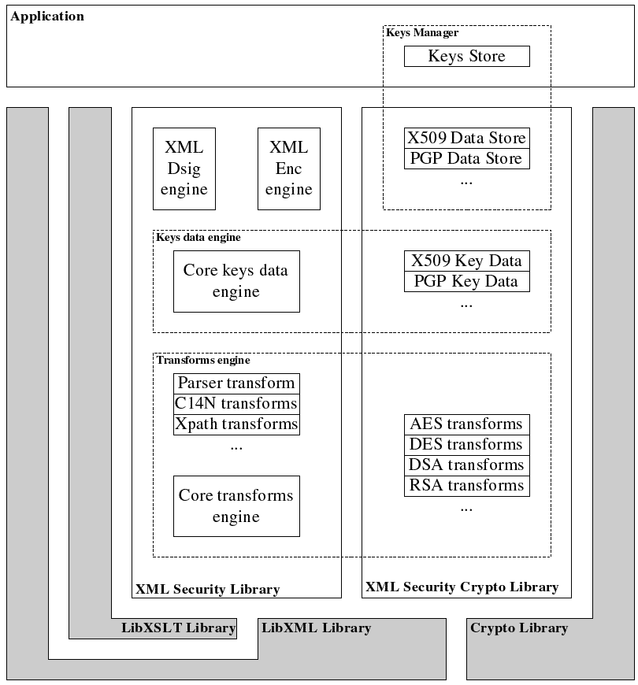
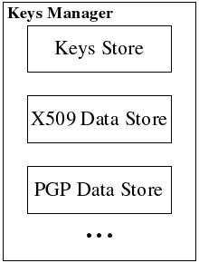
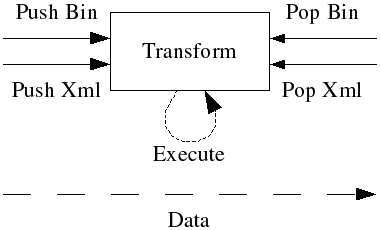
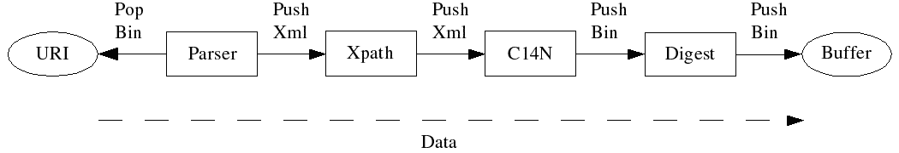
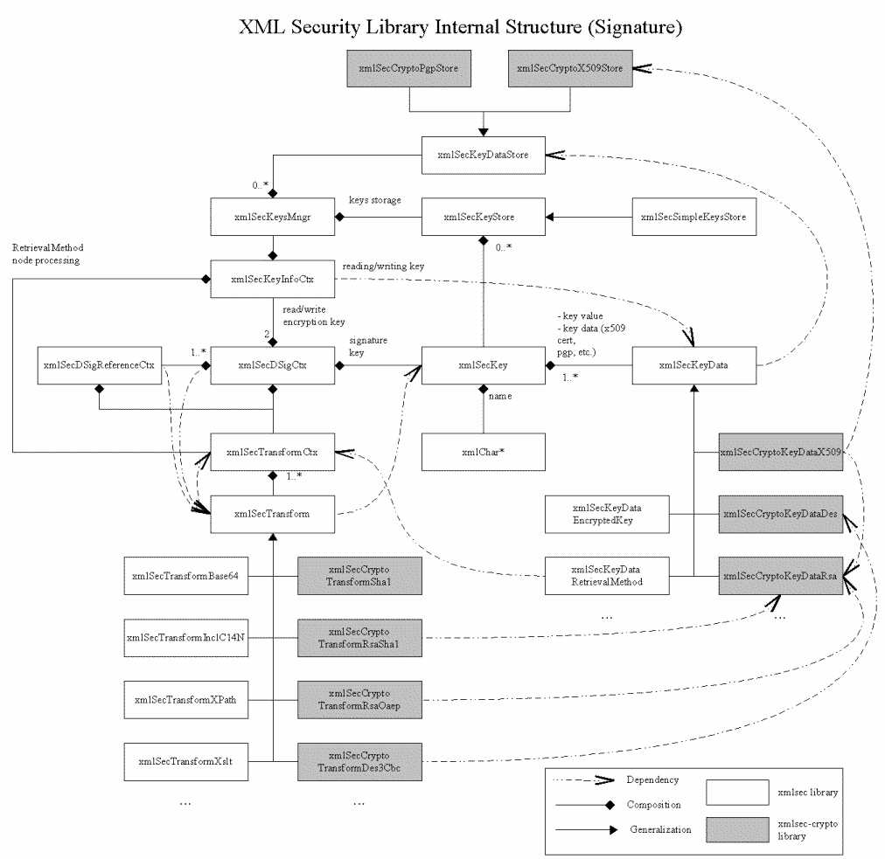
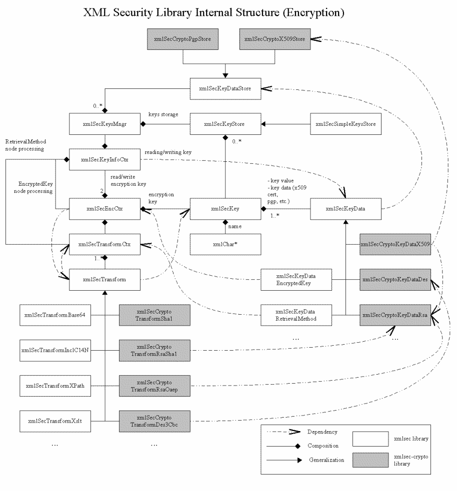

# XML Security Library Tutorial

This tutorial describes how to use XMLSec Library to perform XML Digital Signatures and XML Encryption
operations. For the complete API reference, see the [XML Security Library API Reference](../api/index.html) . For code examples, see the [XML Security Library Examples](../examples/index.md) .

# Overview

XML Security Library provides support for XML Digital Signature and XML Encryption. It is based on LibXML/LibXSLT and can use practicaly any crypto library (currently there is "out of the box" support for OpenSSL, Microsoft Crypto API, Microsoft Cryptography API: Next Generation (CNG), GnuTLS, GCrypt and NSS).

# XML Security Library Structure

In order to provide the an ability to use different crypto engines, the XML Security Library is splitted in two parts: core library (xmlsec) and crypto library (xmlsec-openssl, xmlsec-mscrypt, xmlsec-mscng, xmlsec-gnutls, xmlsec-gcrypt, xmlsec-nss, ...).
> **Figure: The library structure and dependencies**
> 

The core library has no dependency on any crypto library and provides implementation of all the engines as well as support for all the non crypto transforms (xml parser, c14n transforms, xpath and xslt transforms,...). The XML Security Crypto library provides implementations for crypto transforms, crypto keys data and key data stores. Application is linked with particular XML Security Crypto library (or even libraries), but the actual application code might be general enough so switching crypto engine would be a matter of changing several #include directives.

# Building the application with XML Security Library

## Overview

Compiling and linking application with XML Security Library requires specifying correct compilation flags, library files and paths to include and library files. As we discussed before, XML Security Library consist of the core xmlsec library and several xmlsec-crypto libraries. Application has a choice of selecting crypto library at link time or dynamicaly loading it at run time. Please note, that loading crypto engines dynamicaly may introduce security problems on some platforms.

## Include files

In order to use XML Security Library an application should include one or more of the following files:
- [xmlsec/xmlsec.h](#xmlsec-xmlsec) - XML Security Library initialization and shutdown functions;
- [xmlsec/xmldsig.h](#xmlsec-xmldsig) - XML Digital Signature functions;
- [xmlsec/xmlenc.h](#xmlsec-xmlenc) - XML Encryption functions;
- [xmlsec/xmltree.h](#xmlsec-xmltree) - helper functions for XML documents manipulation;
- [xmlsec/templates.h](#xmlsec-templates) - helper functions for dynamic XML Digital Signature and XML Encryption templates creation;
- [xmlsec/crypto.h](#xmlsec-crypto) - automatic XML Security Crypto Library selection.

If necessary, the application should also include LibXML, LibXSLT and crypto library header files.

**Example: Example includes file section**
```
#include <libxml/tree.h>
#include <libxml/xmlmemory.h>
#include <libxml/parser.h>

#ifndef XMLSEC_NO_XSLT
#include <libxslt/xslt.h>
#endif /* XMLSEC_NO_XSLT */

#include <xmlsec/xmlsec.h>
#include <xmlsec/xmltree.h>
#include <xmlsec/xmldsig.h>
#include <xmlsec/xmlenc.h>
#include <xmlsec/templates.h>
#include <xmlsec/crypto.h>
```

## Compiling and linking on Unix

There are several ways to get necessary compilation and linking information on Unix and application can use any of these methods to do crypto engine selection either at linking or run time.

### PKG_CHECK_MODULES() macro

**Example: Using PKG_CHECK_MODULES() macro in a configure.in file to select crypto engine (openssl) at linking time**

```autoconf
dnl
dnl Check for xmlsec and friends
dnl
PKG_CHECK_MODULES(XMLSEC, xmlsec1-openssl >= 1.0.0 xml2 libxslt,,exit)
CFLAGS="$CFLAGS $XMLSEC_CFLAGS"
CPPFLAGS="$CPPFLAGS $XMLSEC_CFLAGS"
LDFLAGS="$LDFLAGS $XMLSEC_LIBS"
```

**Example: Using PKG_CHECK_MODULES() macro in a configure.in file to enable dynamical loading of xmlsec-crypto library**

```autoconf
dnl
dnl Check for xmlsec and friends
dnl
PKG_CHECK_MODULES(XMLSEC, xmlsec1 >= 1.0.0 xml2 libxslt,,exit)
CFLAGS="$CFLAGS $XMLSEC_CFLAGS"
CPPFLAGS="$CPPFLAGS $XMLSEC_CFLAGS"
LDFLAGS="$LDFLAGS $XMLSEC_LIBS"
```

### pkg-config script

**Example: Using pkg-config script in a Makefile to select crypto engine (nss) at linking time**

```makefile
PROGRAM = test
PROGRAM_FILES = test.c

CFLAGS	+= -g $(shell pkg-config --cflags xmlsec1-nss)
LDFLAGS	+= -g
LIBS 	+= $(shell pkg-config --libs xmlsec1-nss)

all: $(PROGRAM)

%: %.c
	$(cc) $(PROGRAM_FILES) $(CFLAGS) $(LDFLAGS) -o $(PROGRAM) $(LIBS)

clean:
	@rm -rf $(PROGRAM)
```

**Example: Using pkg-config script in a Makefile to enable dynamical loading of xmlsec-crypto library**

```makefile
PROGRAM = test
PROGRAM_FILES = test.c

CFLAGS	+= -g $(shell pkg-config --cflags xmlsec1)
LDFLAGS	+= -g
LIBS 	+= $(shell pkg-config --libs xmlsec1)

all: $(PROGRAM)

%: %.c
	$(cc) $(PROGRAM_FILES) $(CFLAGS) $(LDFLAGS) -o $(PROGRAM) $(LIBS)

clean:
	@rm -rf $(PROGRAM)
```

### xmlsec1-config script

**Example: Using xmlsec1-config script in a Makefile to select crypto engine (e.g. gnutls) at linking time**

```makefile
PROGRAM = test
PROGRAM_FILES = test.c

CFLAGS	+= -g $(shell xmlsec1-config --crypto gnutls --cflags)
LDFLAGS	+= -g
LIBS 	+= $(shell xmlsec1-config --crypto gnutls --libs)

all: $(PROGRAM)

%: %.c
	$(cc) $(PROGRAM_FILES) $(CFLAGS) $(LDFLAGS) -o $(PROGRAM) $(LIBS)

clean:
	@rm -rf $(PROGRAM)
```

**Example: Using xmlsec1-config script in a Makefile to enable dynamical loading of xmlsec-crypto library**

```makefile
PROGRAM = test
PROGRAM_FILES = test.c

CFLAGS	+= -g $(shell xmlsec1-config --cflags)
LDFLAGS	+= -g
LIBS 	+= $(shell xmlsec1-config --libs)

all: $(PROGRAM)

%: %.c
	$(cc) $(PROGRAM_FILES) $(CFLAGS) $(LDFLAGS) -o $(PROGRAM) $(LIBS)

clean:
	@rm -rf $(PROGRAM)
```

## Compiling and linking on Windows

On Windows there is no such simple and elegant solution. Please check `README` file in `win32` folder of the library package for latest instructions. However, there are few general things, that you need to remember:

- *All libraries linked to your application must be compiled with the same Microsoft Runtime Libraries.*

- *Static linking with XML Security Library requires additional global defines:*

```c
#define LIBXML_STATIC
#define LIBXSLT_STATIC
#define XMLSEC_STATIC
```

- If you do not want to dynamicaly load xmlsec-crypto library and prefer to select crypto engine at linking then you should link your application with xmlsec and at least one of xmlsec-crypto libraries.

- In order to enable dynamic loading for xmlsec-crypto library you should add additional global define:

```c
#define XMLSEC_CRYPTO_DYNAMIC_LOADING
```

## Compiling and linking on other systems

Well, nothing is impossible, it's only software (you managed to compile the library itself, do you?). I'll be happy to include in this manual your expirience with compiling and linking applications with XML Security Library on other platforms (if you would like to share it).

# Initialization and shutdown

XML Security Library initialization/shutdown process includes initialization and shutdown of the dependent libraries:
- libxml library;
- libxslt library;
- crypto library (OpenSSL, GnuTLS, GCrypt, NSS, ...);
- xmlsec library ( [xmlSecInit](#xmlsecinit) and [xmlSecShutdown](#xmlsecshutdown) functions);
- xmlsec-crypto library ( [xmlSecCryptoDLLoadLibrary](#xmlseccryptodlloadlibrary) to load xmlsec-crypto library dynamicaly if needed, [xmlSecCryptoInit](#xmlseccryptoinit) and [xmlSecCryptoShutdown](#xmlseccryptoshutdown) functions);
xmlsec-crypto library also provides a convinient functions [xmlSecAppCryptoInit](#xmlsecappcryptoinit) and [xmlSecAppCryptoShutdown](#xmlsecappcryptoshutdown) to initialize the crypto library itself but application can do it by itself.

**Example: Initializing application**
```
    /* Init libxml and libxslt libraries */
    xmlInitParser();
    LIBXML_TEST_VERSION
    xmlLoadExtDtdDefaultValue = XML_DETECT_IDS | XML_COMPLETE_ATTRS;
    xmlSubstituteEntitiesDefault(1);
#ifndef XMLSEC_NO_XSLT
    xmlIndentTreeOutput = 1;
#endif /* XMLSEC_NO_XSLT */

    /* Init xmlsec library */
    if(xmlSecInit() < 0) {
	fprintf(stderr, "Error: xmlsec initialization failed.\n");
	return(-1);
    }

    /* Check loaded library version */
    if(xmlSecCheckVersion() != 1) {
	fprintf(stderr, "Error: loaded xmlsec library version is not compatible.\n");
	return(-1);
    }

    /* Load default crypto engine if we are supporting dynamic
     * loading for xmlsec-crypto libraries. Use the crypto library
     * name ("openssl", "nss", etc.) to load corresponding
     * xmlsec-crypto library.
     */
#ifdef XMLSEC_CRYPTO_DYNAMIC_LOADING
    if(xmlSecCryptoDLLoadLibrary(NULL) < 0) {
	fprintf(stderr, "Error: unable to load default xmlsec-crypto library. Make sure\n"
			"that you have it installed and check shared libraries path\n"
			"(LD_LIBRARY_PATH) envornment variable.\n");
	return(-1);
    }
#endif /* XMLSEC_CRYPTO_DYNAMIC_LOADING */

    /* Init crypto library */
    if(xmlSecCryptoAppInit(NULL) < 0) {
	fprintf(stderr, "Error: crypto initialization failed.\n");
	return(-1);
    }

    /* Init xmlsec-crypto library */
    if(xmlSecCryptoInit() < 0) {
	fprintf(stderr, "Error: xmlsec-crypto initialization failed.\n");
	return(-1);
    }
```

**Example: Shutting down application**
```
    /* Shutdown xmlsec-crypto library */
    xmlSecCryptoShutdown();

    /* Shutdown crypto library */
    xmlSecCryptoAppShutdown();

    /* Shutdown xmlsec library */
    xmlSecShutdown();

    /* Shutdown libxslt/libxml */
#ifndef XMLSEC_NO_XSLT
    xsltCleanupGlobals();
#endif /* XMLSEC_NO_XSLT */
    xmlCleanupParser();
```

# Signing and encrypting documents

## Overview

XML Security Library performs signature or encryption by processing input xml or binary data and a template that specifies a signature or encryption skeleton: the transforms, algorithms, the key selection process. A template has the same structure as the desired result but some of the nodes are empty. XML Security Library gets the key for signature/encryption from keys managers using the information from the template, does necessary computations and puts the results in the template. Signature or encryption context controls the whole process and stores the required temporary data.
> **Figure: The signature or encryption processing model**
> 

## Signing a document

The typical signature process includes following steps:
- Prepare data for signature.
- Create or load signature template and select start [<dsig:Signature/>](http://www.w3.org/TR/xmldsig-core/#sec-Signature) node.
- Create signature context [xmlSecDSigCtx](#xmlsecdsigctx) using [xmlSecDSigCtxCreate](#xmlsecdsigctxcreate) or [xmlSecDSigCtxInitialize](#xmlsecdsigctxinitialize) functions.
- Load signature key in [keys manager](#xmlseckeysmngr) or generate a session key and set it in the signature context ( `signKey` member of [xmlSecDSigCtx](#xmlsecdsigctx) structure).
- Sign data by calling [xmlSecDSigCtxSign](#xmlsecdsigctxsign) function.
- Check returned value and consume signed data.
- Destroy signature context [xmlSecDSigCtx](#xmlsecdsigctx) using [xmlSecDSigCtxDestroy](#xmlsecdsigctxdestroy) or [xmlSecDSigCtxFinalize](#xmlsecdsigctxfinalize) functions.

**Example: Signing a template**
```
/**
 * sign_file:
 * @tmpl_file:		the signature template file name.
 * @key_file:		the PEM private key file name.
 *
 * Signs the #tmpl_file using private key from #key_file.
 *
 * Returns 0 on success or a negative value if an error occurs.
 */
int
sign_file(const char* tmpl_file, const char* key_file) {
    xmlDocPtr doc = NULL;
    xmlNodePtr node = NULL;
    xmlSecDSigCtxPtr dsigCtx = NULL;
    int res = -1;

    assert(tmpl_file);
    assert(key_file);

    /* load template */
    doc = xmlParseFile(tmpl_file);
    if ((doc == NULL) || (xmlDocGetRootElement(doc) == NULL)){
	fprintf(stderr, "Error: unable to parse file \"%s\"\n", tmpl_file);
	goto done;
    }

    /* find start node */
    node = xmlSecFindNode(xmlDocGetRootElement(doc), xmlSecNodeSignature, xmlSecDSigNs);
    if(node == NULL) {
	fprintf(stderr, "Error: start node not found in \"%s\"\n", tmpl_file);
	goto done;
    }

    /* create signature context, we don't need keys manager in this example */
    dsigCtx = xmlSecDSigCtxCreate(NULL);
    if(dsigCtx == NULL) {
        fprintf(stderr,"Error: failed to create signature context\n");
	goto done;
    }

    /* load private key, assuming that there is not password */
    dsigCtx->signKey = xmlSecCryptoAppKeyLoad(key_file, xmlSecKeyDataFormatPem, NULL, NULL, NULL);
    if(dsigCtx->signKey == NULL) {
        fprintf(stderr,"Error: failed to load private pem key from \"%s\"\n", key_file);
	goto done;
    }

    /* set key name to the file name, this is just an example! */
    if(xmlSecKeySetName(dsigCtx->signKey, key_file) < 0) {
    	fprintf(stderr,"Error: failed to set key name for key from \"%s\"\n", key_file);
	goto done;
    }

    /* sign the template */
    if(xmlSecDSigCtxSign(dsigCtx, node) < 0) {
        fprintf(stderr,"Error: signature failed\n");
	goto done;
    }

    /* print signed document to stdout */
    xmlDocDump(stdout, doc);

    /* success */
    res = 0;

done:
    /* cleanup */
    if(dsigCtx != NULL) {
	xmlSecDSigCtxDestroy(dsigCtx);
    }

    if(doc != NULL) {
	xmlFreeDoc(doc);
    }
    return(res);
}
```
[Full program listing](#xmlsec-example-sign1)
[Simple signature template file](#xmlsec-example-sign1-tmpl)

## Encrypting data

The typical encryption process includes following steps:
- Prepare data for encryption.
- Create or load encryption template and select start <enc:EncryptedData/> node.
- Create encryption context [xmlSecEncCtx](#xmlsecencctx) using [xmlSecEncCtxCreate](#xmlsecencctxcreate) or [xmlSecEncCtxInitialize](#xmlsecencctxinitialize) functions.
- Load encryption key in [keys manager](#xmlseckeysmngr) or generate a session key and set it in the encryption context ( `encKey` member of [xmlSecEncCtx](#xmlsecencctx) structure).
- Encrypt data by calling one of the following functions:
  - [xmlSecEncCtxBinaryEncrypt](#xmlsecencctxbinaryencrypt)
  - [xmlSecEncCtxXmlEncrypt](#xmlsecencctxxmlencrypt)
  - [xmlSecEncCtxUriEncrypt](#xmlsecencctxuriencrypt)
- Check returned value and if necessary consume encrypted data.
- Destroy encryption context [xmlSecEncCtx](#xmlsecencctx) using [xmlSecEncCtxDestroy](#xmlsecencctxdestroy) or [xmlSecEncCtxFinalize](#xmlsecencctxfinalize) functions.

**Example: Encrypting binary data with a template**
```
/**
 * encrypt_file:
 * @tmpl_file:		the encryption template file name.
 * @key_file:		the Triple DES key file.
 * @data:		the binary data to encrypt.
 * @dataSize:		the binary data size.
 *
 * Encrypts binary #data using template from #tmpl_file and DES key from
 * #key_file.
 *
 * Returns 0 on success or a negative value if an error occurs.
 */
int
encrypt_file(const char* tmpl_file, const char* key_file, const unsigned char* data, size_t dataSize) {
    xmlDocPtr doc = NULL;
    xmlNodePtr node = NULL;
    xmlSecEncCtxPtr encCtx = NULL;
    int res = -1;

    assert(tmpl_file);
    assert(key_file);
    assert(data);

    /* load template */
    doc = xmlParseFile(tmpl_file);
    if ((doc == NULL) || (xmlDocGetRootElement(doc) == NULL)){
	fprintf(stderr, "Error: unable to parse file \"%s\"\n", tmpl_file);
	goto done;
    }

    /* find start node */
    node = xmlSecFindNode(xmlDocGetRootElement(doc), xmlSecNodeEncryptedData, xmlSecEncNs);
    if(node == NULL) {
	fprintf(stderr, "Error: start node not found in \"%s\"\n", tmpl_file);
	goto done;
    }

    /* create encryption context, we don't need keys manager in this example */
    encCtx = xmlSecEncCtxCreate(NULL);
    if(encCtx == NULL) {
        fprintf(stderr,"Error: failed to create encryption context\n");
	goto done;
    }

    /* load DES key */
    encCtx->encKey = xmlSecKeyReadBinaryFile(xmlSecKeyDataDesId, key_file);
    if(encCtx->encKey == NULL) {
        fprintf(stderr,"Error: failed to load des key from binary file \"%s\"\n", key_file);
	goto done;
    }

    /* set key name to the file name, this is just an example! */
    if(xmlSecKeySetName(encCtx->encKey, key_file) < 0) {
    	fprintf(stderr,"Error: failed to set key name for key from \"%s\"\n", key_file);
	goto done;
    }

    /* encrypt the data */
    if(xmlSecEncCtxBinaryEncrypt(encCtx, node, data, dataSize) < 0) {
        fprintf(stderr,"Error: encryption failed\n");
    	goto done;
    }

    /* print encrypted data with document to stdout */
    xmlDocDump(stdout, doc);

    /* success */
    res = 0;

done:
    /* cleanup */
    if(encCtx != NULL) {
	xmlSecEncCtxDestroy(encCtx);
    }

    if(doc != NULL) {
	xmlFreeDoc(doc);
    }
    return(res);
}
```
[Full program listing](#xmlsec-example-encrypt1)
[Simple encryption template file](#xmlsec-example-encrypt1-tmpl)

# Creating dynamic templates

## Overview

The XML Security Library uses templates to describe how and what data should be signed or encrypted. The template is a regular XML file. You can create templates in advance using your favorite XML files editor, load them from a file and use for creating signature or encrypting data. You can also create templates dynamicaly. The XML Security Library provides helper functions to quickly create dynamic templates inside your application.

## Creating dynamic signature templates

The signature template has structure similar to the XML Digital Signature structure as it is described in [specification](http://www.w3.org/TR/xmldsig-core) . The only difference is that some nodes (for example, <dsig:DigestValue/> or <SignatureValue/>) are empty. The XML Security Library sets the content of these nodes after doing necessary calculations.

**XML Digital Signature structure**
```
<dsig:Signature ID?>
    <dsig:SignedInfo>
        <dsig:CanonicalizationMethod Algorithm />
        <dsig:SignatureMethod Algorithm />
        (<dsig:Reference URI? >
    	    (<dsig:Transforms>
		(<dsig:Transform Algorithm />)+
	     </dsig:Transforms>)?
	    <dsig:DigestMethod Algorithm >
	    <dsig:DigestValue>
	</dsig:Reference>)+
    </dsig:SignedInfo>
    <dsig:SignatureValue>
    (<dsig:KeyInfo>
	<dsig:KeyName>?
	<dsig:KeyValue>?
	<dsig:RetrievalMethod>?
	<dsig:X509Data>?
	<dsig:PGPData>?
	<enc:EncryptedKey>?
	<enc:AgreementMethod>?
	<dsig:KeyName>?
	<dsig:RetrievalMethod>?
	<*>?
    </dsig:KeyInfo>)?
    (<dsig:Object ID?>)*
</dsig:Signature>
```

**Example: Creating dynamic signature template**
```
/**
 * sign_file:
 * @xml_file:		the XML file name.
 * @key_file:		the PEM private key file name.
 *
 * Signs the #xml_file using private key from #key_file and dynamicaly
 * created enveloped signature template.
 *
 * Returns 0 on success or a negative value if an error occurs.
 */
int
sign_file(const char* xml_file, const char* key_file) {
    xmlDocPtr doc = NULL;
    xmlNodePtr signNode = NULL;
    xmlNodePtr refNode = NULL;
    xmlNodePtr keyInfoNode = NULL;
    xmlSecDSigCtxPtr dsigCtx = NULL;
    int res = -1;

    assert(xml_file);
    assert(key_file);

    /* load doc file */
    doc = xmlParseFile(xml_file);
    if ((doc == NULL) || (xmlDocGetRootElement(doc) == NULL)){
	fprintf(stderr, "Error: unable to parse file \"%s\"\n", xml_file);
	goto done;
    }

    /* create signature template for RSA-SHA1 enveloped signature */
    signNode = xmlSecTmplSignatureCreate(doc, xmlSecTransformExclC14NId,
				         xmlSecTransformRsaSha1Id, NULL);
    if(signNode == NULL) {
	fprintf(stderr, "Error: failed to create signature template\n");
	goto done;
    }

    /* add <dsig:Signature/> node to the doc */
    xmlAddChild(xmlDocGetRootElement(doc), signNode);

    /* add reference */
    refNode = xmlSecTmplSignatureAddReference(signNode, xmlSecTransformSha1Id,
					NULL, NULL, NULL);
    if(refNode == NULL) {
	fprintf(stderr, "Error: failed to add reference to signature template\n");
	goto done;
    }

    /* add enveloped transform */
    if(xmlSecTmplReferenceAddTransform(refNode, xmlSecTransformEnvelopedId) == NULL) {
	fprintf(stderr, "Error: failed to add enveloped transform to reference\n");
	goto done;
    }

    /* add <dsig:KeyInfo/> and <dsig:KeyName/> nodes to put key name in the signed document */
    keyInfoNode = xmlSecTmplSignatureEnsureKeyInfo(signNode, NULL);
    if(keyInfoNode == NULL) {
	fprintf(stderr, "Error: failed to add key info\n");
	goto done;
    }

    if(xmlSecTmplKeyInfoAddKeyName(keyInfoNode, NULL) == NULL) {
	fprintf(stderr, "Error: failed to add key name\n");
	goto done;
    }

    /* create signature context, we don't need keys manager in this example */
    dsigCtx = xmlSecDSigCtxCreate(NULL);
    if(dsigCtx == NULL) {
        fprintf(stderr,"Error: failed to create signature context\n");
	goto done;
    }

    /* load private key, assuming that there is not password */
    dsigCtx->signKey = xmlSecCryptoAppKeyLoad(key_file, xmlSecKeyDataFormatPem, NULL, NULL, NULL);
    if(dsigCtx->signKey == NULL) {
        fprintf(stderr,"Error: failed to load private pem key from \"%s\"\n", key_file);
	goto done;
    }

    /* set key name to the file name, this is just an example! */
    if(xmlSecKeySetName(dsigCtx->signKey, key_file) < 0) {
    	fprintf(stderr,"Error: failed to set key name for key from \"%s\"\n", key_file);
	goto done;
    }

    /* sign the template */
    if(xmlSecDSigCtxSign(dsigCtx, signNode) < 0) {
        fprintf(stderr,"Error: signature failed\n");
	goto done;
    }

    /* print signed document to stdout */
    xmlDocDump(stdout, doc);

    /* success */
    res = 0;

done:
    /* cleanup */
    if(dsigCtx != NULL) {
	xmlSecDSigCtxDestroy(dsigCtx);
    }

    if(doc != NULL) {
	xmlFreeDoc(doc);
    }
    return(res);
}
```
[Full program listing](#xmlsec-example-sign2)

## Creating dynamic encryption templates

The encryption template has structure similar to the XML Encryption structure as it is described in [specification](http://www.w3.org/TR/xmlenc-core) . The only difference is that some nodes (for example, <enc:CipherValue/>) are empty. The XML Security Library sets the content of these nodes after doing necessary calculations.

**XML Encryption structure**
```
<enc:EncryptedData Id? Type? MimeType? Encoding?>
    <enc:EncryptionMethod Algorithm />?
    (<dsig:KeyInfo>
	<dsig:KeyName>?
	<dsig:KeyValue>?
	<dsig:RetrievalMethod>?
	<dsig:X509Data>?
	<dsig:PGPData>?
	<enc:EncryptedKey>?
	<enc:AgreementMethod>?
	<dsig:KeyName>?
	<dsig:RetrievalMethod>?
	<*>?
    </dsig:KeyInfo>)?
    <enc:CipherData>
	<enc:CipherValue>?
	<enc:CipherReference URI?>?
    </enc:CipherData>
    <enc:EncryptionProperties>?
</enc:EncryptedData>
```

**Example: Creating dynamic encrytion template**
```
/**
 * encrypt_file:
 * @xml_file:		the encryption template file name.
 * @key_file:		the Triple DES key file.
 *
 * Encrypts #xml_file using a dynamicaly created template and DES key from
 * #key_file.
 *
 * Returns 0 on success or a negative value if an error occurs.
 */
int
encrypt_file(const char* xml_file, const char* key_file) {
    xmlDocPtr doc = NULL;
    xmlNodePtr encDataNode = NULL;
    xmlNodePtr keyInfoNode = NULL;
    xmlSecEncCtxPtr encCtx = NULL;
    int res = -1;

    assert(xml_file);
    assert(key_file);

    /* load template */
    doc = xmlParseFile(xml_file);
    if ((doc == NULL) || (xmlDocGetRootElement(doc) == NULL)){
	fprintf(stderr, "Error: unable to parse file \"%s\"\n", xml_file);
	goto done;
    }

    /* create encryption template to encrypt XML file and replace
     * its content with encryption result */
    encDataNode = xmlSecTmplEncDataCreate(doc, xmlSecTransformDes3CbcId,
				NULL, xmlSecTypeEncElement, NULL, NULL);
    if(encDataNode == NULL) {
	fprintf(stderr, "Error: failed to create encryption template\n");
	goto done;
    }

    /* we want to put encrypted data in the <enc:CipherValue/> node */
    if(xmlSecTmplEncDataEnsureCipherValue(encDataNode) == NULL) {
	fprintf(stderr, "Error: failed to add CipherValue node\n");
	goto done;
    }

    /* add <dsig:KeyInfo/> and <dsig:KeyName/> nodes to put key name in the signed document */
    keyInfoNode = xmlSecTmplEncDataEnsureKeyInfo(encDataNode, NULL);
    if(keyInfoNode == NULL) {
	fprintf(stderr, "Error: failed to add key info\n");
	goto done;
    }

    if(xmlSecTmplKeyInfoAddKeyName(keyInfoNode, NULL) == NULL) {
	fprintf(stderr, "Error: failed to add key name\n");
	goto done;
    }

    /* create encryption context, we don't need keys manager in this example */
    encCtx = xmlSecEncCtxCreate(NULL);
    if(encCtx == NULL) {
        fprintf(stderr,"Error: failed to create encryption context\n");
	goto done;
    }

    /* load DES key, assuming that there is not password */
    encCtx->encKey = xmlSecKeyReadBinaryFile(xmlSecKeyDataDesId, key_file);
    if(encCtx->encKey == NULL) {
        fprintf(stderr,"Error: failed to load des key from binary file \"%s\"\n", key_file);
	goto done;
    }

    /* set key name to the file name, this is just an example! */
    if(xmlSecKeySetName(encCtx->encKey, key_file) < 0) {
    	fprintf(stderr,"Error: failed to set key name for key from \"%s\"\n", key_file);
	goto done;
    }

    /* encrypt the data */
    if(xmlSecEncCtxXmlEncrypt(encCtx, encDataNode, xmlDocGetRootElement(doc)) < 0) {
        fprintf(stderr,"Error: encryption failed\n");
	goto done;
    }

    /* we template is inserted in the doc */
    encDataNode = NULL;

    /* print encrypted data with document to stdout */
    xmlDocDump(stdout, doc);

    /* success */
    res = 0;

done:

    /* cleanup */
    if(encCtx != NULL) {
	xmlSecEncCtxDestroy(encCtx);
    }

    if(encDataNode != NULL) {
	xmlFreeNode(encDataNode);
    }

    if(doc != NULL) {
	xmlFreeDoc(doc);
    }
    return(res);
}
```
[Full program listing](#xmlsec-example-encrypt2)

# Verifing and decrypting documents

## Overview

Since the template is just an XML file, it might be created in advance and saved in a file. It's also possible for application to create templates without using XML Security Library functions. Also in some cases template should be inserted in the signed or encrypted data (for example, if you want to create an enveloped or enveloping signature).

Signature verification and data decryption do not require template because all the necessary information is provided in the signed or encrypted document.
> **Figure: The verification or decryption processing model**
> 

## Verifying a signed document

The typical signature verification process includes following steps:
- Load keys, X509 certificates, etc. in the [keys manager](#xmlseckeysmngr) .
- Create signature context [xmlSecDSigCtx](#xmlsecdsigctx) using [xmlSecDSigCtxCreate](#xmlsecdsigctxcreate) or [xmlSecDSigCtxInitialize](#xmlsecdsigctxinitialize) functions.
- Select start verification [<dsig:Signature/>](http://www.w3.org/TR/xmldsig-core/#sec-Signature) node in the signed XML document.
- Verify signature by calling [xmlSecDSigCtxVerify](#xmlsecdsigctxverify) function.
- Check returned value and verification status ( `status` member of [xmlSecDSigCtx](#xmlsecdsigctx) structure). If necessary, consume returned data from the [context](#xmlsecdsigctx) .
- Destroy signature context [xmlSecDSigCtx](#xmlsecdsigctx) using [xmlSecDSigCtxDestroy](#xmlsecdsigctxdestroy) or [xmlSecDSigCtxFinalize](#xmlsecdsigctxfinalize) functions.

**Example: Verifying a document**
```
/**
 * verify_file:
 * @xml_file:		the signed XML file name.
 * @key_file:		the PEM public key file name.
 *
 * Verifies XML signature in #xml_file using public key from #key_file.
 *
 * Returns 0 on success or a negative value if an error occurs.
 */
int
verify_file(const char* xml_file, const char* key_file) {
    xmlDocPtr doc = NULL;
    xmlNodePtr node = NULL;
    xmlSecDSigCtxPtr dsigCtx = NULL;
    int res = -1;

    assert(xml_file);
    assert(key_file);

    /* load file */
    doc = xmlParseFile(xml_file);
    if ((doc == NULL) || (xmlDocGetRootElement(doc) == NULL)){
	fprintf(stderr, "Error: unable to parse file \"%s\"\n", xml_file);
	goto done;
    }

    /* find start node */
    node = xmlSecFindNode(xmlDocGetRootElement(doc), xmlSecNodeSignature, xmlSecDSigNs);
    if(node == NULL) {
	fprintf(stderr, "Error: start node not found in \"%s\"\n", xml_file);
	goto done;
    }

    /* create signature context, we don't need keys manager in this example */
    dsigCtx = xmlSecDSigCtxCreate(NULL);
    if(dsigCtx == NULL) {
        fprintf(stderr,"Error: failed to create signature context\n");
	goto done;
    }

    /* load public key */
    dsigCtx->signKey = xmlSecCryptoAppKeyLoad(key_file,xmlSecKeyDataFormatPem, NULL, NULL, NULL);
    if(dsigCtx->signKey == NULL) {
        fprintf(stderr,"Error: failed to load public pem key from \"%s\"\n", key_file);
	goto done;
    }

    /* set key name to the file name, this is just an example! */
    if(xmlSecKeySetName(dsigCtx->signKey, key_file) < 0) {
    	fprintf(stderr,"Error: failed to set key name for key from \"%s\"\n", key_file);
	goto done;
    }

    /* Verify signature */
    if(xmlSecDSigCtxVerify(dsigCtx, node) < 0) {
        fprintf(stderr,"Error: signature verify\n");
	goto done;
    }

    /* print verification result to stdout */
    if(dsigCtx->status == xmlSecDSigStatusSucceeded) {
	fprintf(stdout, "Signature is OK\n");
    } else {
	fprintf(stdout, "Signature is INVALID\n");
    }

    /* success */
    res = 0;

done:
    /* cleanup */
    if(dsigCtx != NULL) {
	xmlSecDSigCtxDestroy(dsigCtx);
    }

    if(doc != NULL) {
	xmlFreeDoc(doc);
    }
    return(res);
}
```
[Full Program Listing](#xmlsec-example-verify1)

## Decrypting an encrypted document

The typical decryption process includes following steps:
- Load keys, X509 certificates, etc. in the [keys manager](#xmlseckeysmngr) .
- Create encryption context [xmlSecEncCtx](#xmlsecencctx) using [xmlSecEncCtxCreate](#xmlsecencctxcreate) or [xmlSecEncCtxInitialize](#xmlsecencctxinitialize) functions.
- Select start decryption <enc:EncryptedData> node.
- Decrypt by calling [xmlSecencCtxDecrypt](#xmlsecencctxdecrypt) function.
- Check returned value and if necessary consume encrypted data.
- Destroy encryption context [xmlSecEncCtx](#xmlsecencctx) using [xmlSecEncCtxDestroy](#xmlsecencctxdestroy) or [xmlSecEncCtxFinalize](#xmlsecencctxfinalize) functions.

**Example: Decrypting a document**
```
int
decrypt_file(const char* enc_file, const char* key_file) {
    xmlDocPtr doc = NULL;
    xmlNodePtr node = NULL;
    xmlSecEncCtxPtr encCtx = NULL;
    int res = -1;

    assert(enc_file);
    assert(key_file);

    /* load template */
    doc = xmlParseFile(enc_file);
    if ((doc == NULL) || (xmlDocGetRootElement(doc) == NULL)){
	fprintf(stderr, "Error: unable to parse file \"%s\"\n", enc_file);
	goto done;
    }

    /* find start node */
    node = xmlSecFindNode(xmlDocGetRootElement(doc), xmlSecNodeEncryptedData, xmlSecEncNs);
    if(node == NULL) {
	fprintf(stderr, "Error: start node not found in \"%s\"\n", enc_file);
	goto done;
    }

    /* create encryption context, we don't need keys manager in this example */
    encCtx = xmlSecEncCtxCreate(NULL);
    if(encCtx == NULL) {
        fprintf(stderr,"Error: failed to create encryption context\n");
	goto done;
    }

    /* load DES key */
    encCtx->encKey = xmlSecKeyReadBinaryFile(xmlSecKeyDataDesId, key_file);
    if(encCtx->encKey == NULL) {
        fprintf(stderr,"Error: failed to load des key from binary file \"%s\"\n", key_file);
	goto done;
    }

    /* set key name to the file name, this is just an example! */
    if(xmlSecKeySetName(encCtx->encKey, key_file) < 0) {
    	fprintf(stderr,"Error: failed to set key name for key from \"%s\"\n", key_file);
	goto done;
    }

    /* decrypt the data */
    if((xmlSecEncCtxDecrypt(encCtx, node) < 0) || (encCtx->result == NULL)) {
        fprintf(stderr,"Error: decryption failed\n");
	goto done;
    }

    /* print decrypted data to stdout */
    if(encCtx->resultReplaced != 0) {
	fprintf(stdout, "Decrypted XML data:\n");
	xmlDocDump(stdout, doc);
    } else {
	fprintf(stdout, "Decrypted binary data (%d bytes):\n", xmlSecBufferGetSize(encCtx->result));
	if(xmlSecBufferGetData(encCtx->result) != NULL) {
	    fwrite(xmlSecBufferGetData(encCtx->result),
	          1,
	          xmlSecBufferGetSize(encCtx->result),
	          stdout);
	}
    }
    fprintf(stdout, "\n");

    /* success */
    res = 0;

done:
    /* cleanup */
    if(encCtx != NULL) {
	xmlSecEncCtxDestroy(encCtx);
    }

    if(doc != NULL) {
	xmlFreeDoc(doc);
    }
    return(res);
}
```
[Full Program Listing](#xmlsec-example-decrypt1)

# Keys

A key in XML Security Library is a representation of the [<dsig:KeyInfo/>](http://www.w3.org/TR/xmldsig-core/#sec-KeyInfo) element and consist of several key data objects. The "value" key data usually contains raw key material (or handlers to key material) required to execute particular crypto transform. Other key data objects may contain any additional information about the key. All the key data objects in the key are associated with the same key material. For example, if a DSA key material has both an X509 certificate and a PGP data associated with it then such a key can have a DSA key "value" and two key data objects for X509 certificate and PGP key data.

> **Figure: The key structure**
> 

XML Security Library has several "invisible" key data classes. These classes never show up in the keys data list of a key but are used for [<dsig:KeyInfo/>](http://www.w3.org/TR/xmldsig-core/#sec-KeyInfo) children processing ( [<dsig:KeyName/>](http://www.w3.org/TR/xmldsig-core/#sec-KeyName) , <enc:EncryptedKey/>, ...). As with transforms, application might add any new key data objects or replace the default ones.

# Keys manager

## Overview

Processing some of the key data objects require additional information which is global across the application (or in the particular area of the application). For example, X509 certificates processing require a common list of trusted certificates to be available. XML Security Library keeps all the common information for key data processing in a a collection of key data stores called "keys manager".

> **Figure: The keys manager structure**
> 

Keys manager has a special "keys store" which lists the keys known to the application. This "keys store" is used by XML Security Library to lookup keys by name, type and crypto algorithm (for example, during [<dsig:KeyName/>](http://www.w3.org/TR/xmldsig-core/#sec-KeyName) processing). The XML Security Library provides default simple "flat list" based implementation of a default keys store. The application can replace it with any other keys store (for example, based on an SQL database).

Keys manager is the only object in XML Security Library which is supposed to be shared by many different operations. Usually keys manager is initialized once at the application startup and later is used by XML Security library routines in "read-only" mode. If application or crypto function need to modify any of the key data stores inside keys manager then proper synchronization must be implemented. In the same time, application can create a new keys manager each time it needs to perform XML signature, verification, encryption or decryption.

## Simple keys store

XML Security Library has a built-in simple keys store implemented using a keys list. You can use it in your application if you have a small number of keys. However, this might be not a best option from performance point of view if you have a lot of keys. In this case, you probably should implement your own keys store using an SQL database or some other keys storage.

**Example: Initializing keys manager and loading keys from PEM files**
```
/**
 * load_keys:
 * @files:		the list of filenames.
 * @files_size:		the number of filenames in #files.
 *
 * Creates default keys manager and load PEM keys from #files in it.
 * The caller is responsible for destroing returned keys manager using
 * @xmlSecKeysMngrDestroy.
 *
 * Returns the pointer to newly created keys manager or NULL if an error
 * occurs.
 */
xmlSecKeysMngrPtr
load_keys(char** files, int files_size) {
    xmlSecKeysMngrPtr mngr;
    xmlSecKeyPtr key;
    int i;

    assert(files);
    assert(files_size > 0);

    /* create and initialize keys manager, we use a default list based
     * keys manager, implement your own xmlSecKeysStore klass if you need
     * something more sophisticated
     */
    mngr = xmlSecKeysMngrCreate();
    if(mngr == NULL) {
	fprintf(stderr, "Error: failed to create keys manager.\n");
	return(NULL);
    }
    if(xmlSecCryptoAppDefaultKeysMngrInit(mngr) < 0) {
	fprintf(stderr, "Error: failed to initialize keys manager.\n");
	xmlSecKeysMngrDestroy(mngr);
	return(NULL);
    }

    for(i = 0; i < files_size; ++i) {
	assert(files[i]);

	/* load key */
	key = xmlSecCryptoAppKeyLoad(files[i], xmlSecKeyDataFormatPem, NULL, NULL, NULL);
	if(key == NULL) {
    	    fprintf(stderr,"Error: failed to load pem key from \"%s\"\n", files[i]);
	    xmlSecKeysMngrDestroy(mngr);
	    return(NULL);
	}

	/* set key name to the file name, this is just an example! */
	if(xmlSecKeySetName(key, BAD_CAST files[i]) < 0) {
    	    fprintf(stderr,"Error: failed to set key name for key from \"%s\"\n", files[i]);
	    xmlSecKeyDestroy(key);
	    xmlSecKeysMngrDestroy(mngr);
	    return(NULL);
	}

	/* add key to keys manager, from now on keys manager is responsible
	 * for destroying key
	 */
	if(xmlSecCryptoAppDefaultKeysMngrAdoptKey(mngr, key) < 0) {
    	    fprintf(stderr,"Error: failed to add key from \"%s\" to keys manager\n", files[i]);
	    xmlSecKeyDestroy(key);
	    xmlSecKeysMngrDestroy(mngr);
	    return(NULL);
	}
    }

    return(mngr);
}
```
[Full program listing](#xmlsec-example-verify2)

## Using keys manager for signatures/encryption

Instead of specifiying signature or encryption key in the corresponding context object ( `signKey` member of [xmlSecDSigCtx](#xmlsecdsigctx) structure or `encKey` member of [xmlSecEncCtx](#xmlsecencctx) structure), the application can use keys manager to select the signature or encryption key. This is especialy useful when you are encrypting or signing something with a session key which is by itself should be encrypted. The key for the session key encryption in the [<EncryptedKey/>](http://www.w3.org/TR/xmlenc-core/#sec-EncryptedKey) node could be selected using [<dsig:KeyName/>](http://www.w3.org/TR/xmldsig-core/#sec-KeyName) node in the template.

**Example: Encrypting file using a session key and a permanent key from keys manager**
```
/**
 * load_rsa_keys:
 * @key_file:		the key filename.
 *
 * Creates default keys manager and load RSA key from #key_file in it.
 * The caller is responsible for destroing returned keys manager using
 * @xmlSecKeysMngrDestroy.
 *
 * Returns the pointer to newly created keys manager or NULL if an error
 * occurs.
 */
xmlSecKeysMngrPtr
load_rsa_keys(char* key_file) {
    xmlSecKeysMngrPtr mngr;
    xmlSecKeyPtr key;

    assert(key_file);

    /* create and initialize keys manager, we use a default list based
     * keys manager, implement your own xmlSecKeysStore klass if you need
     * something more sophisticated
     */
    mngr = xmlSecKeysMngrCreate();
    if(mngr == NULL) {
	fprintf(stderr, "Error: failed to create keys manager.\n");
	return(NULL);
    }
    if(xmlSecCryptoAppDefaultKeysMngrInit(mngr) < 0) {
	fprintf(stderr, "Error: failed to initialize keys manager.\n");
	xmlSecKeysMngrDestroy(mngr);
	return(NULL);
    }

    /* load private RSA key */
    key = xmlSecCryptoAppKeyLoad(key_file, xmlSecKeyDataFormatPem, NULL, NULL, NULL);
    if(key == NULL) {
        fprintf(stderr,"Error: failed to load rsa key from file \"%s\"\n", key_file);
        xmlSecKeysMngrDestroy(mngr);
        return(NULL);
    }

    /* set key name to the file name, this is just an example! */
    if(xmlSecKeySetName(key, BAD_CAST key_file) < 0) {
        fprintf(stderr,"Error: failed to set key name for key from \"%s\"\n", key_file);
        xmlSecKeyDestroy(key);
	xmlSecKeysMngrDestroy(mngr);
	return(NULL);
    }

    /* add key to keys manager, from now on keys manager is responsible
     * for destroying key
     */
    if(xmlSecCryptoAppDefaultKeysMngrAdoptKey(mngr, key) < 0) {
        fprintf(stderr,"Error: failed to add key from \"%s\" to keys manager\n", key_file);
        xmlSecKeyDestroy(key);
        xmlSecKeysMngrDestroy(mngr);
        return(NULL);
    }

    return(mngr);
}

/**
 * encrypt_file:
 * @mngr:		the pointer to keys manager.
 * @xml_file:		the encryption template file name.
 * @key_name:		the RSA key name.
 *
 * Encrypts #xml_file using a dynamicaly created template, a session DES key
 * and an RSA key from keys manager.
 *
 * Returns 0 on success or a negative value if an error occurs.
 */
int
encrypt_file(xmlSecKeysMngrPtr mngr, const char* xml_file, const char* key_name) {
    xmlDocPtr doc = NULL;
    xmlNodePtr encDataNode = NULL;
    xmlNodePtr keyInfoNode = NULL;
    xmlNodePtr encKeyNode = NULL;
    xmlNodePtr keyInfoNode2 = NULL;
    xmlSecEncCtxPtr encCtx = NULL;
    int res = -1;

    assert(mngr);
    assert(xml_file);
    assert(key_name);

    /* load template */
    doc = xmlParseFile(xml_file);
    if ((doc == NULL) || (xmlDocGetRootElement(doc) == NULL)){
	fprintf(stderr, "Error: unable to parse file \"%s\"\n", xml_file);
	goto done;
    }

    /* create encryption template to encrypt XML file and replace
     * its content with encryption result */
    encDataNode = xmlSecTmplEncDataCreate(doc, xmlSecTransformDes3CbcId,
				NULL, xmlSecTypeEncElement, NULL, NULL);
    if(encDataNode == NULL) {
	fprintf(stderr, "Error: failed to create encryption template\n");
	goto done;
    }

    /* we want to put encrypted data in the <enc:CipherValue/> node */
    if(xmlSecTmplEncDataEnsureCipherValue(encDataNode) == NULL) {
	fprintf(stderr, "Error: failed to add CipherValue node\n");
	goto done;
    }

    /* add <dsig:KeyInfo/> */
    keyInfoNode = xmlSecTmplEncDataEnsureKeyInfo(encDataNode, NULL);
    if(keyInfoNode == NULL) {
	fprintf(stderr, "Error: failed to add key info\n");
	goto done;
    }

    /* add <enc:EncryptedKey/> to store the encrypted session key */
    encKeyNode = xmlSecTmplKeyInfoAddEncryptedKey(keyInfoNode,
				    xmlSecTransformRsaOaepId,
				    NULL, NULL, NULL);
    if(encKeyNode == NULL) {
	fprintf(stderr, "Error: failed to add key info\n");
	goto done;
    }

    /* we want to put encrypted key in the <enc:CipherValue/> node */
    if(xmlSecTmplEncDataEnsureCipherValue(encKeyNode) == NULL) {
	fprintf(stderr, "Error: failed to add CipherValue node\n");
	goto done;
    }

    /* add <dsig:KeyInfo/> and <dsig:KeyName/> nodes to <enc:EncryptedKey/> */
    keyInfoNode2 = xmlSecTmplEncDataEnsureKeyInfo(encKeyNode, NULL);
    if(keyInfoNode2 == NULL) {
	fprintf(stderr, "Error: failed to add key info\n");
	goto done;
    }

    /* set key name so we can lookup key when needed */
    if(xmlSecTmplKeyInfoAddKeyName(keyInfoNode2, key_name) == NULL) {
	fprintf(stderr, "Error: failed to add key name\n");
	goto done;
    }

    /* create encryption context */
    encCtx = xmlSecEncCtxCreate(mngr);
    if(encCtx == NULL) {
        fprintf(stderr,"Error: failed to create encryption context\n");
	goto done;
    }

    /* generate a Triple DES key */
    encCtx->encKey = xmlSecKeyGenerate(xmlSecKeyDataDesId, 192, xmlSecKeyDataTypeSession);
    if(encCtx->encKey == NULL) {
        fprintf(stderr,"Error: failed to generate session des key\n");
	goto done;
    }

    /* encrypt the data */
    if(xmlSecEncCtxXmlEncrypt(encCtx, encDataNode, xmlDocGetRootElement(doc)) < 0) {
        fprintf(stderr,"Error: encryption failed\n");
	goto done;
    }

    /* we template is inserted in the doc */
    encDataNode = NULL;

    /* print encrypted data with document to stdout */
    xmlDocDump(stdout, doc);

    /* success */
    res = 0;

done:

    /* cleanup */
    if(encCtx != NULL) {
	xmlSecEncCtxDestroy(encCtx);
    }

    if(encDataNode != NULL) {
	xmlFreeNode(encDataNode);
    }

    if(doc != NULL) {
	xmlFreeDoc(doc);
    }
    return(res);
}
```
[Full program listing](#xmlsec-example-encrypt3)

## Using keys manager for verification/decryption

If more than one key could be used for signature or encryption, then using `signKey` member of [xmlSecDSigCtx](#xmlsecdsigctx) structure or `encKey` member of [xmlSecEncCtx](#xmlsecencctx) structure is not possible. Instead, the application should load known keys in the keys manager and use <dsig:KeyName/> element to specify the key name.

**Example: Initializing keys manager and loading DES keys from binary files**
```
/**
 * load_des_keys:
 * @files:		the list of filenames.
 * @files_size:		the number of filenames in #files.
 *
 * Creates default keys manager and load DES keys from #files in it.
 * The caller is responsible for destroing returned keys manager using
 * @xmlSecKeysMngrDestroy.
 *
 * Returns the pointer to newly created keys manager or NULL if an error
 * occurs.
 */
xmlSecKeysMngrPtr
load_des_keys(char** files, int files_size) {
    xmlSecKeysMngrPtr mngr;
    xmlSecKeyPtr key;
    int i;

    assert(files);
    assert(files_size > 0);

    /* create and initialize keys manager, we use a default list based
     * keys manager, implement your own xmlSecKeysStore klass if you need
     * something more sophisticated
     */
    mngr = xmlSecKeysMngrCreate();
    if(mngr == NULL) {
	fprintf(stderr, "Error: failed to create keys manager.\n");
	return(NULL);
    }
    if(xmlSecCryptoAppDefaultKeysMngrInit(mngr) < 0) {
	fprintf(stderr, "Error: failed to initialize keys manager.\n");
	xmlSecKeysMngrDestroy(mngr);
	return(NULL);
    }

    for(i = 0; i < files_size; ++i) {
	assert(files[i]);

	/* load DES key */
	key = xmlSecKeyReadBinaryFile(xmlSecKeyDataDesId, files[i]);
	if(key == NULL) {
    	    fprintf(stderr,"Error: failed to load des key from binary file \"%s\"\n", files[i]);
	    xmlSecKeysMngrDestroy(mngr);
	    return(NULL);
	}

	/* set key name to the file name, this is just an example! */
	if(xmlSecKeySetName(key, BAD_CAST files[i]) < 0) {
    	    fprintf(stderr,"Error: failed to set key name for key from \"%s\"\n", files[i]);
	    xmlSecKeyDestroy(key);
	    xmlSecKeysMngrDestroy(mngr);
	    return(NULL);
	}

	/* add key to keys manager, from now on keys manager is responsible
	 * for destroying key
	 */
	if(xmlSecCryptoAppDefaultKeysMngrAdoptKey(mngr, key) < 0) {
    	    fprintf(stderr,"Error: failed to add key from \"%s\" to keys manager\n", files[i]);
	    xmlSecKeyDestroy(key);
	    xmlSecKeysMngrDestroy(mngr);
	    return(NULL);
	}
    }

    return(mngr);
}
```
[Full program listing](#xmlsec-example-decrypt2)

## Implementing a custom keys store

In many cases, a default built-in list based keys store is not good enough. For example, XML Security Library (and the built-in default keys store) have no synchronization and you'll need to implement a custom keys store if you want to add or remove keys while other threads use the store.

**Example: Creating a custom keys manager**
```
/**
 * create_files_keys_mngr:
 *
 * Creates a files based keys manager: we assume that key name is
 * the key file name,
 *
 * Returns pointer to newly created keys manager or NULL if an error occurs.
 */
xmlSecKeysMngrPtr
create_files_keys_mngr(void) {
    xmlSecKeyStorePtr keysStore;
    xmlSecKeysMngrPtr mngr;

    /* create files based keys store */
    keysStore = xmlSecKeyStoreCreate(files_keys_store_get_klass());
    if(keysStore == NULL) {
	fprintf(stderr, "Error: failed to create keys store.\n");
	return(NULL);
    }

    /* create keys manager */
    mngr = xmlSecKeysMngrCreate();
    if(mngr == NULL) {
	fprintf(stderr, "Error: failed to create keys manager.\n");
	xmlSecKeyStoreDestroy(keysStore);
	return(NULL);
    }

    /* add store to keys manager, from now on keys manager destroys the store if needed */
    if(xmlSecKeysMngrAdoptKeysStore(mngr, keysStore) < 0) {
	fprintf(stderr, "Error: failed to add keys store to keys manager.\n");
	xmlSecKeyStoreDestroy(keysStore);
	xmlSecKeysMngrDestroy(mngr);
	return(NULL);
    }

    /* initialize crypto library specific data in keys manager */
    if(xmlSecCryptoKeysMngrInit(mngr) < 0) {
	fprintf(stderr, "Error: failed to initialize crypto data in keys manager.\n");
	xmlSecKeysMngrDestroy(mngr);
	return(NULL);
    }

    /* set the get key callback */
    mngr->getKey = xmlSecKeysMngrGetKey;
    return(mngr);
}

/****************************************************************************
 *
 * Files Keys Store: we assume that key's name (content of the
 * <dsig:KeyName/> element is a name of the file with a key.
 * Attention: this probably not a good solution for high traffic systems.
 *
 ***************************************************************************/
static xmlSecKeyPtr		files_keys_store_find_key	(xmlSecKeyStorePtr store,
								 const xmlChar* name,
								 xmlSecKeyInfoCtxPtr keyInfoCtx);
static xmlSecKeyStoreKlass files_keys_store_klass = {
    sizeof(xmlSecKeyStoreKlass),
    sizeof(xmlSecKeyStore),
    BAD_CAST "files-based-keys-store",	/* const xmlChar* name; */
    NULL,				/* xmlSecKeyStoreInitializeMethod initialize; */
    NULL,				/* xmlSecKeyStoreFinalizeMethod finalize; */
    files_keys_store_find_key,		/* xmlSecKeyStoreFindKeyMethod findKey; */

    /* reserved for the future */
    NULL,				/* void* reserved0; */
    NULL,				/* void* reserved1; */
};

/**
 * files_keys_store_get_klass:
 *
 * The files based keys store klass: we assume that key name is the
 * key file name,
 *
 * Returns files based keys store klass.
 */
xmlSecKeyStoreId
files_keys_store_get_klass(void) {
    return(&files_keys_store_klass);
}

/**
 * files_keys_store_find_key:
 * @store:		the pointer to default keys store.
 * @name:		the desired key name.
 * @keyInfoCtx:		the pointer to <dsig:KeyInfo/> node processing context.
 *
 * Lookups key in the @store.
 *
 * Returns pointer to key or NULL if key not found or an error occurs.
 */
static xmlSecKeyPtr
files_keys_store_find_key(xmlSecKeyStorePtr store, const xmlChar* name, xmlSecKeyInfoCtxPtr keyInfoCtx) {
    xmlSecKeyPtr key;
    const xmlChar* p;

    assert(store);
    assert(keyInfoCtx);

    /* it's possible to do not have the key name or desired key type
     * but we could do nothing in this case */
    if((name == NULL) || (keyInfoCtx->keyReq.keyId == xmlSecKeyDataIdUnknown)){
	return(NULL);
    }

    /* we don't want to open files in a folder other than "current";
     * to prevent it limit the characters in the key name to alpha/digit,
     * '.', '-' or '_'.
     */
    for(p = name; (*p) != '\0'; ++p) {
	if(!isalnum((*p)) && ((*p) != '.') && ((*p) != '-') && ((*p) != '_')) {
	    return(NULL);
	}
    }

    if((keyInfoCtx->keyReq.keyId == xmlSecKeyDataDsaId) || (keyInfoCtx->keyReq.keyId == xmlSecKeyDataRsaId)) {
	/* load key from a pem file, if key is not found then it's an error (is it?) */
	key = xmlSecCryptoAppKeyLoad(name, xmlSecKeyDataFormatPem, NULL, NULL, NULL);
	if(key == NULL) {
    	    fprintf(stderr,"Error: failed to load pem key from \"%s\"\n", name);
	    return(NULL);
	}
    } else {
	/* otherwise it's a binary key, if key is not found then it's an error (is it?) */
	key = xmlSecKeyReadBinaryFile(keyInfoCtx->keyReq.keyId, name);
	if(key == NULL) {
    	    fprintf(stderr,"Error: failed to load key from binary file \"%s\"\n", name);
	    return(NULL);
	}
    }

    /* set key name */
    if(xmlSecKeySetName(key, name) < 0) {
        fprintf(stderr,"Error: failed to set key name for key from \"%s\"\n", name);
        xmlSecKeyDestroy(key);
        return(NULL);
    }

    return(key);
}
```
[Full program listing](#xmlsec-example-decrypt3)

# Using X509 Certificates

## Overview

X509 certificate is one of many possible keys data object that can be associated with a key. Application may read and write X509 data from/to XML file. The X509 certificates management policies significantly vary from one crypto library to another. The examples in this chapter were tested with OpenSSL and they might be broken if anither crypto engine is used. Check API reference documentation for more specific information about your crypto engine.

## Signing data with X509 certificate

To sign a file using X509 certificate, an application need to associate the certificate (or certificates) with the private key using one of the following functions:
- [xmlSecOpenSSLAppKeyCertLoad](#xmlsecopensslappkeycertload) - loads certificate from a file and adds to the key;
- [xmlSecOpenSSLAppPkcs12Load](#xmlsecopensslapppkcs12load) - loads private key and all the certificates associated with it from a PKCS12 file;
- [xmlSecKeyAdoptData](#xmlseckeyadoptdata) - low level function to add key data (including X509 key data) to the key.
**Example: Loading private key and X509 certificate**
```
    /* load private key, assuming that there is not password */
    key = xmlSecCryptoAppKeyLoad(key_file, xmlSecKeyDataFormatPem, NULL, NULL, NULL);
    if(key == NULL) {
        fprintf(stderr,"Error: failed to load private pem key from \"%s\"\n", key_file);
	goto done;
    }

    /* load certificate and add to the key */
    if(xmlSecCryptoAppKeyCertLoad(key, cert_file, xmlSecKeyDataFormatPem) < 0) {
        fprintf(stderr,"Error: failed to load pem certificate \"%s\"\n", cert_file);
	goto done;
    }
```
[Full program listing](#xmlsec-example-sign3)

Next step is to prepare signature template with <dsig:X509Data/> child of the <dsig:KeyInfo/> element. When XML Security Library finds this node in the template, it automatically creates <dsig:X509Certificate/> children of the <dsig:X509Data/> element and writes to result XML document all the certificates associated with the signature key.
**Example: Dynamicaly creating a signature template for signing document using X509 certificate**
```
    /* create signature template for RSA-SHA1 enveloped signature */
    signNode = xmlSecTmplSignatureCreate(doc, xmlSecTransformExclC14NId,
				         xmlSecTransformRsaSha1Id, NULL);
    if(signNode == NULL) {
	fprintf(stderr, "Error: failed to create signature template\n");
	goto done;
    }

    /* add <dsig:Signature/> node to the doc */
    xmlAddChild(xmlDocGetRootElement(doc), signNode);

    /* add reference */
    refNode = xmlSecTmplSignatureAddReference(signNode, xmlSecTransformSha1Id,
					NULL, NULL, NULL);
    if(refNode == NULL) {
	fprintf(stderr, "Error: failed to add reference to signature template\n");
	goto done;
    }

    /* add enveloped transform */
    if(xmlSecTmplReferenceAddTransform(refNode, xmlSecTransformEnvelopedId) == NULL) {
	fprintf(stderr, "Error: failed to add enveloped transform to reference\n");
	goto done;
    }

    /* add <dsig:KeyInfo/> and <dsig:X509Data/> */
    keyInfoNode = xmlSecTmplSignatureEnsureKeyInfo(signNode, NULL);
    if(keyInfoNode == NULL) {
	fprintf(stderr, "Error: failed to add key info\n");
	goto done;
    }

    if(xmlSecTmplKeyInfoAddX509Data(keyInfoNode) == NULL) {
	fprintf(stderr, "Error: failed to add X509Data node\n");
	goto done;
    }
```
[Full program listing](#xmlsec-example-sign3)

## Verifing document signed with X509 certificates

If the document is signed with an X509 certificate then the signature verification consist of two steps:
- Creating and verifing X509 certificates chain.
- Verifing signature itself using key exrtacted from a certificate verified on previous step.
Certificates chain is constructed from certificates in a way that each certificate in the chain is signed with previous one:
**Certificates chain**
```
Certificate A (signed with B) <- Certificate B (signed with C) <- ... <- Root Certificate (signed by itself)
```
At the end of the chain there is a "Root Certificate" which is signed by itself. There is no way to verify the validity of the root certificate and application have to "trust" it (another name for root certificates is "trusted" certificates).

Application can use [xmlSecCryptoAppKeysMngrCertLoad](#xmlseccryptoappkeysmngrcertload) function to load both "trusted" and "un-trusted" certificates. However, the selection of "trusted" certificates is very sensitive process and this function might be not implemented for some crypto engines. In this case, the "trusted" certificates list is loaded during initialization or specified in crypto engine configuration files. Check XML Security Library API reference for more details.
**Example: Loading trusted X509 certificate**
```
/**
 * load_trusted_certs:
 * @files:		the list of filenames.
 * @files_size:		the number of filenames in #files.
 *
 * Creates simple keys manager and load trusted certificates from PEM #files.
 * The caller is responsible for destroing returned keys manager using
 * @xmlSecKeysMngrDestroy.
 *
 * Returns the pointer to newly created keys manager or NULL if an error
 * occurs.
 */
xmlSecKeysMngrPtr
load_trusted_certs(char** files, int files_size) {
    xmlSecKeysMngrPtr mngr;
    int i;

    assert(files);
    assert(files_size > 0);

    /* create and initialize keys manager, we use a simple list based
     * keys manager, implement your own xmlSecKeysStore klass if you need
     * something more sophisticated
     */
    mngr = xmlSecKeysMngrCreate();
    if(mngr == NULL) {
	fprintf(stderr, "Error: failed to create keys manager.\n");
	return(NULL);
    }
    if(xmlSecCryptoAppDefaultKeysMngrInit(mngr) < 0) {
	fprintf(stderr, "Error: failed to initialize keys manager.\n");
	xmlSecKeysMngrDestroy(mngr);
	return(NULL);
    }

    for(i = 0; i < files_size; ++i) {
	assert(files[i]);

	/* load trusted cert */
	if(xmlSecCryptoAppKeysMngrCertLoad(mngr, files[i], xmlSecKeyDataFormatPem, xmlSecKeyDataTypeTrusted) < 0) {
    	    fprintf(stderr,"Error: failed to load pem certificate from \"%s\"\n", files[i]);
	    xmlSecKeysMngrDestroy(mngr);
	    return(NULL);
	}
    }

    return(mngr);
}
```
[Full program listing](#xmlsec-example-verify3)

# Transforms and transforms chain

XML Digital Signature and XML Encryption standards are very flexible and provide an XML developer many different ways to sign or encrypt any part (or even parts) of an XML document. The key for such great flexibility is the "transforms" model. Transform is defined as a method of pre-processing binary or XML data before calculating digest or signature. XML Security Library extends this definition and names "transform" any operation performed on the data: reading data from an URI, xml parsing, xml transformation, calculation digest, encrypting or decrypting. Each XML Security Library transform provides at least one of the following callbacks:
- [push binary data](#xmlsectransformpushbinmethod) ;
- [push xml data](#xmlsectransformpushxmlmethod) ;
- [pop binary data](#xmlsectransformpopbinmethod) ;
- [pop xml data](#xmlsectransformpopxmlmethod) .

One additional [execute](#xmlsectransformexecutemethod) callback was added to simplify the development and reduce code size. This callback is used by default implementations of the four external callbacks from the list above. For example, most of the crypto transforms could be implemented by just implementing one "execute" callback and using default push/pop binary data callbacks. However, in some cases using push/pop callbacks directly is more efficient.

> **Figure: The XML Security Library transform**
> 

XML Security Library constructs transforms chain according to the signature/encryption template or signed/encrypted document. If necessary, XML Security Library inserts XML parser or defaul canonicalization to ensure that the output data type (binary or XML) of previous transform matches the input of the next transform.

The data are processed by pushing through or poping from the chain depending on the transforms in the chain. For example, then binary data chunk is pushed through a binary-to-binary transform, it processes this chunk and pushes the result to the next transform in the chain.

> **Figure: Transforms chain created for <dsig:Reference/> element processing**
> 

# Using context objects

The great flexibility of XML Digital Signature and XML Encryption specification is one of the most interesting and in the same time, most dangerouse feature for an application developer. For example, XPath and XSLT transform can make it very difficult to find out what exactly was signed by just looking at the transforms and the input data. Many protocols based on XML Digital Signature and XML Encryption restrict allowed key data types, allowed transforms or possible input data. For example, signature in a simple SAML Response should have only one <dsig:Reference/> element with an empty or NULL URI attribute and only one enveloped transform. XML Security Library uses "context" objects to let application enable or disable particular features, return the result data and the information collected during the processing. Also all the context objects defined in XML Security library have a special `userData` member which could be used by application to pass application specific data around. XML Security Library never use this field. The application creates a new [xmlSecDSigCtx](#xmlsecdsigctx) or [xmlSecEncCtx](#xmlsecencctx) object for each operation, sets necessary options and consumes result returned in the context after signature, verification, encryption or decryption.

**Example: SAML signature validation**
```
/**
 * verify_file:
 * @mngr:		the pointer to keys manager.
 * @xml_file:		the signed XML file name.
 *
 * Verifies XML signature in #xml_file.
 *
 * Returns 0 on success or a negative value if an error occurs.
 */
int
verify_file(xmlSecKeysMngrPtr mngr, const char* xml_file) {
    xmlDocPtr doc = NULL;
    xmlNodePtr node = NULL;
    xmlSecDSigCtxPtr dsigCtx = NULL;
    int res = -1;

    assert(mngr);
    assert(xml_file);

    /* load file */
    doc = xmlParseFile(xml_file);
    if ((doc == NULL) || (xmlDocGetRootElement(doc) == NULL)){
	fprintf(stderr, "Error: unable to parse file \"%s\"\n", xml_file);
	goto done;
    }

    /* find start node */
    node = xmlSecFindNode(xmlDocGetRootElement(doc), xmlSecNodeSignature, xmlSecDSigNs);
    if(node == NULL) {
	fprintf(stderr, "Error: start node not found in \"%s\"\n", xml_file);
	goto done;
    }

    /* create signature context */
    dsigCtx = xmlSecDSigCtxCreate(mngr);
    if(dsigCtx == NULL) {
        fprintf(stderr,"Error: failed to create signature context\n");
	goto done;
    }

    /* limit the Reference URI attributes to empty or NULL */
    dsigCtx->enabledReferenceUris = xmlSecTransformUriTypeEmpty;

    /* limit allowed transforms for signature and reference processing */
    if((xmlSecDSigCtxEnableSignatureTransform(dsigCtx, xmlSecTransformInclC14NId) < 0) ||
       (xmlSecDSigCtxEnableSignatureTransform(dsigCtx, xmlSecTransformExclC14NId) < 0) ||
       (xmlSecDSigCtxEnableSignatureTransform(dsigCtx, xmlSecTransformSha1Id) < 0) ||
       (xmlSecDSigCtxEnableSignatureTransform(dsigCtx, xmlSecTransformRsaSha1Id) < 0)) {

        fprintf(stderr,"Error: failed to limit allowed signature transforms\n");
	goto done;
    }
    if((xmlSecDSigCtxEnableReferenceTransform(dsigCtx, xmlSecTransformInclC14NId) < 0) ||
       (xmlSecDSigCtxEnableReferenceTransform(dsigCtx, xmlSecTransformExclC14NId) < 0) ||
       (xmlSecDSigCtxEnableReferenceTransform(dsigCtx, xmlSecTransformSha1Id) < 0) ||
       (xmlSecDSigCtxEnableReferenceTransform(dsigCtx, xmlSecTransformEnvelopedId) < 0)) {

        fprintf(stderr,"Error: failed to limit allowed reference transforms\n");
	goto done;
    }

    /* in addition, limit possible key data to valid X509 certificates only */
    if(xmlSecPtrListAdd(&(dsigCtx->keyInfoReadCtx.enabledKeyData), BAD_CAST xmlSecKeyDataX509Id) < 0) {
        fprintf(stderr,"Error: failed to limit allowed key data\n");
	goto done;
    }

    /* Verify signature */
    if(xmlSecDSigCtxVerify(dsigCtx, node) < 0) {
        fprintf(stderr,"Error: signature verify\n");
	goto done;
    }

    /* check that we have only one Reference */
    if((dsigCtx->status == xmlSecDSigStatusSucceeded) &&
        (xmlSecPtrListGetSize(&(dsigCtx->signedInfoReferences)) != 1)) {

        fprintf(stderr,"Error: only one reference is allowed\n");
	goto done;
    }

    /* print verification result to stdout */
    if(dsigCtx->status == xmlSecDSigStatusSucceeded) {
	fprintf(stdout, "Signature is OK\n");
    } else {
	fprintf(stdout, "Signature is INVALID\n");
    }

    /* success */
    res = 0;

done:
    /* cleanup */
    if(dsigCtx != NULL) {
	xmlSecDSigCtxDestroy(dsigCtx);
    }

    if(doc != NULL) {
	xmlFreeDoc(doc);
    }
    return(res);
}
```

# APPENDIX A. XML Security Library Signature Klasses

> **Figure: XML Security Library Signature Klasses**
> 

# APPENDIX B. XML Security Library Encryption Klasses

> **Figure: XML Security Library Encryption Klasses**
> 

