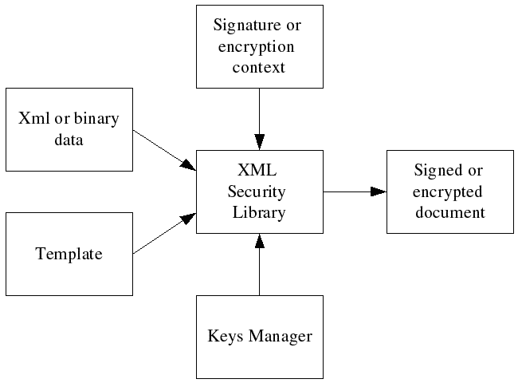

# Signing and encrypting documents

## Overview

The XML Security Library performs signing or encryption by processing a
template that specifies the signing or encryption parameters
(transforms, algorithms, keys, etc.) and, optionally, the input XML or
binary data if it is not already included in the template. The
template has the same structure as the desired result, but some of its
nodes might be empty. The XML Security Library finds the key for
signing or encryption in the keys manager or in the signing/encryption
context, performs the required cryptographic operations, and finally
writes the results to the output XML document. The signing/encryption
context controls the process and stores the required temporary data.

### Figure: The signature or encryption processing model


## Signing a document

A typical signature process includes the following steps:
- Create or load a signature template, and select the
  [dsig:Signature](http://www.w3.org/TR/xmldsig-core/#sec-Signature)
  node.
- Create a signature context using the
  [xmlSecDSigCtxCreate](../api/xmlsec_core_xmldsig.md#xmlsecdsigctxcreate)
  function.
- Load the signing key(s), X509 certificates, etc. into the
  [keys manager](../api/xmlsec_core_keysmngr.md#xmlseckeysmngrcreate)
  or set the key in the signature context (the `signKey` member of the
  [xmlSecDSigCtx](../api/xmlsec_core_xmldsig.md#xmlsecdsigctxcreate)
  structure).
- Sign the data by calling the
  [xmlSecDSigCtxSign](../api/xmlsec_core_xmldsig.md#xmlsecdsigctxsign)
  function.
- Check the returned value to make sure there are no errors.
- Destroy the signature context using the
  [xmlSecDSigCtxDestroy](../api/xmlsec_core_xmldsig.md#xmlsecdsigctxdestroy)
  function.


### Example: Signing a template

```c

/**
 * @brief Signs an XML template file using a private key.
 * @details Signs the #tmpl_file using private key from #key_file.
 * @param tmpl_file the signature template file name.
 * @param key_file the PEM private key file name.
 * @return 0 on success or a negative value if an error occurs.
 */
int
sign_file(const char* tmpl_file, const char* key_file) {
    xmlDocPtr doc = NULL;
    xmlNodePtr node = NULL;
    xmlSecDSigCtxPtr dsigCtx = NULL;
    int res = -1;

    assert(tmpl_file);
    assert(key_file);

    /* load template */
    doc = xmlReadFile(tmpl_file, NULL, XML_PARSE_PEDANTIC | XML_PARSE_NONET | XML_PARSE_NOENT);
    if ((doc == NULL) || (xmlDocGetRootElement(doc) == NULL)){
        fprintf(stderr, "Error: unable to parse file \"%s\"\n", tmpl_file);
        goto done;
    }

    /* find start node */
    node = xmlSecFindNode(xmlDocGetRootElement(doc), xmlSecNodeSignature, xmlSecDSigNs);
    if(node == NULL) {
        fprintf(stderr, "Error: start node not found in \"%s\"\n", tmpl_file);
        goto done;
    }

    /* create signature context, we don't need keys manager in this example */
    dsigCtx = xmlSecDSigCtxCreate(NULL);
    if(dsigCtx == NULL) {
        fprintf(stderr,"Error: failed to create signature context\n");
        goto done;
    }

    /* load private key, assuming that there is no password */
    dsigCtx->signKey = xmlSecCryptoAppKeyLoadEx(key_file,
        xmlSecKeyDataTypePrivate,
        xmlSecKeyDataFormatPem,
        NULL,
        NULL,
        NULL);
    if(dsigCtx->signKey == NULL) {
        fprintf(stderr,"Error: failed to load private pem key from \"%s\"\n", key_file);
        goto done;
    }

    /* set the key name to the file name; this is only an example */
    if(xmlSecKeySetName(dsigCtx->signKey, BAD_CAST key_file) < 0) {
        fprintf(stderr,"Error: failed to set key name for key from \"%s\"\n", key_file);
        goto done;
    }

    /* sign the template */
    if(xmlSecDSigCtxSign(dsigCtx, node) < 0) {
        fprintf(stderr,"Error: signature failed\n");
        goto done;
    }

    /* print signed document to stdout */
    xmlDocDump(stdout, doc);

    /* success */
    res = 0;

done:
    /* cleanup */
    if(dsigCtx != NULL) {
        xmlSecDSigCtxDestroy(dsigCtx);
    }

    if(doc != NULL) {
        xmlFreeDoc(doc);
    }
    return(res);
}
```

[Full program listing](../examples/sign1.md)

## Encrypting data

A typical encryption process includes the following steps:
- Create or load an encryption template and select the starting
  [enc:EncryptedData](http://www.w3.org/TR/xmlenc-core/#sec-EncryptedData)
  node.
- Create an encryption context using the
  [xmlSecEncCtxCreate](../api/xmlsec_core_xmlenc.md#xmlsecencctxcreate)
  function.
- Load the encryption key(s), X509 certificates, etc. into the
  [keys manager](../api/xmlsec_core_keysmngr.md#xmlseckeysmngrcreate)
  or set the key in the encryption context (the `encKey` member of
  [xmlSecEncCtx](../api/xmlsec_core_xmlenc.md#xmlsecencctxcreate)
  structure).
- Encrypt the data by calling one of the following functions:
  - [xmlSecEncCtxBinaryEncrypt](../api/xmlsec_core_xmlenc.md#xmlsecencctxbinaryencrypt)
  - [xmlSecEncCtxXmlEncrypt](../api/xmlsec_core_xmlenc.md#xmlsecencctxxmlencrypt)
  - [xmlSecEncCtxUriEncrypt](../api/xmlsec_core_xmlenc.md#xmlsecencctxuriencrypt)
- Check the returned value to make sure there are no errors.
- Destroy the encryption context using the
  [xmlSecEncCtxDestroy](../api/xmlsec_core_xmlenc.md#xmlsecencctxdestroy)
  function.

### Example: Encrypting binary data with a template

```c

/**
 * @brief Encrypts binary data using a DES key and a template file.
 * @details Encrypts binary #data using template from #tmpl_file and DES key from
 * #key_file.
 * @param tmpl_file the encryption template file name.
 * @param key_file the Triple DES key file.
 * @param data the binary data to encrypt.
 * @param dataSize the binary data size.
 * @return 0 on success or a negative value if an error occurs.
 */
int
encrypt_file(const char* tmpl_file, const char* key_file,
             const unsigned char* data, size_t dataSize) {
    xmlDocPtr doc = NULL;
    xmlNodePtr node = NULL;
    xmlSecEncCtxPtr encCtx = NULL;
    int res = -1;

    assert(tmpl_file);
    assert(key_file);
    assert(data);

    /* load template */
    doc = xmlReadFile(tmpl_file, NULL, XML_PARSE_PEDANTIC | XML_PARSE_NONET | XML_PARSE_NOENT);
    if ((doc == NULL) || (xmlDocGetRootElement(doc) == NULL)){
        fprintf(stderr, "Error: unable to parse file \"%s\"\n", tmpl_file);
        goto done;
    }

    /* find start node */
    node = xmlSecFindNode(xmlDocGetRootElement(doc), xmlSecNodeEncryptedData, xmlSecEncNs);
    if(node == NULL) {
        fprintf(stderr, "Error: start node not found in \"%s\"\n", tmpl_file);
        goto done;
    }

    /* create encryption context, we don't need keys manager in this example */
    encCtx = xmlSecEncCtxCreate(NULL);
    if(encCtx == NULL) {
        fprintf(stderr,"Error: failed to create encryption context\n");
        goto done;
    }

    /* load DES key, assuming that there is no password */
    encCtx->encKey = xmlSecKeyReadBinaryFile(xmlSecKeyDataDesId, key_file);
    if(encCtx->encKey == NULL) {
        fprintf(stderr,"Error: failed to load des key from binary file \"%s\"\n", key_file);
        goto done;
    }

    /* set the key name to the file name; this is only an example */
    if(xmlSecKeySetName(encCtx->encKey, BAD_CAST key_file) < 0) {
        fprintf(stderr,"Error: failed to set key name for key from \"%s\"\n", key_file);
        goto done;
    }

    /* encrypt the data */
    if(xmlSecEncCtxBinaryEncrypt(encCtx, node, data, dataSize) < 0) {
        fprintf(stderr,"Error: encryption failed\n");
        goto done;
    }

    /* print encrypted data with document to stdout */
    xmlDocDump(stdout, doc);

    /* success */
    res = 0;

done:

    /* cleanup */
    if(encCtx != NULL) {
        xmlSecEncCtxDestroy(encCtx);
    }

    if(doc != NULL) {
        xmlFreeDoc(doc);
    }
    return(res);
}
```

[Full program listing](../examples/encrypt1.md)

