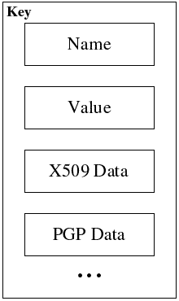

# Keys

A key in XML Security Library is a representation of the [<dsig:KeyInfo/>](http://www.w3.org/TR/xmldsig-core/#sec-KeyInfo) element and consist of several key data objects. The "value" key data usually contains raw key material (or handlers to key material) required to execute particular crypto transform. Other key data objects may contain any additional information about the key. All the key data objects in the key are associated with the same key material. For example, if a DSA key material has both an X509 certificate and a PGP data associated with it then such a key can have a DSA key "value" and two key data objects for X509 certificate and PGP key data.

> **Figure: The key structure**
> 

XML Security Library has several "invisible" key data classes. These classes never show up in the keys data list of a key but are used for [<dsig:KeyInfo/>](http://www.w3.org/TR/xmldsig-core/#sec-KeyInfo) children processing ( [<dsig:KeyName/>](http://www.w3.org/TR/xmldsig-core/#sec-KeyName) , [<enc:EncryptedKey/>](http://www.w3.org/TR/xmlenc-core/#sec-EncryptedKey), ...). As with transforms, application might add any new key data objects or replace the default ones.

