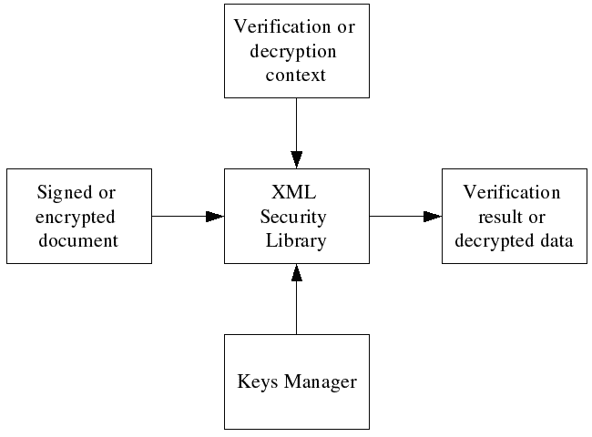

# Verifing and decrypting documents

## Overview

Since the template is just an XML file, it might be created in advance and saved in a file. It's also possible for application to create templates without using XML Security Library functions. Also in some cases template should be inserted in the signed or encrypted data (for example, if you want to create an enveloped or enveloping signature).

Signature verification and data decryption do not require template because all the necessary information is provided in the signed or encrypted document.
> **Figure: The verification or decryption processing model**
> 

## Verifying a signed document

The typical signature verification process includes following steps:
- Load keys, X509 certificates, etc. in the [keys manager](#xmlseckeysmngr) .
- Create signature context [xmlSecDSigCtx](#xmlsecdsigctx) using [xmlSecDSigCtxCreate](#xmlsecdsigctxcreate) or [xmlSecDSigCtxInitialize](#xmlsecdsigctxinitialize) functions.
- Select start verification [<dsig:Signature/>](http://www.w3.org/TR/xmldsig-core/#sec-Signature) node in the signed XML document.
- Verify signature by calling [xmlSecDSigCtxVerify](#xmlsecdsigctxverify) function.
- Check returned value and verification status ( `status` member of [xmlSecDSigCtx](#xmlsecdsigctx) structure). If necessary, consume returned data from the [context](#xmlsecdsigctx) .
- Destroy signature context [xmlSecDSigCtx](#xmlsecdsigctx) using [xmlSecDSigCtxDestroy](#xmlsecdsigctxdestroy) or [xmlSecDSigCtxFinalize](#xmlsecdsigctxfinalize) functions.

**Example: Verifying a document**
```
/**
 * verify_file:
 * @xml_file:		the signed XML file name.
 * @key_file:		the PEM public key file name.
 *
 * Verifies XML signature in #xml_file using public key from #key_file.
 *
 * Returns 0 on success or a negative value if an error occurs.
 */
int
verify_file(const char* xml_file, const char* key_file) {
    xmlDocPtr doc = NULL;
    xmlNodePtr node = NULL;
    xmlSecDSigCtxPtr dsigCtx = NULL;
    int res = -1;

    assert(xml_file);
    assert(key_file);

    /* load file */
    doc = xmlParseFile(xml_file);
    if ((doc == NULL) || (xmlDocGetRootElement(doc) == NULL)){
	fprintf(stderr, "Error: unable to parse file \"%s\"\n", xml_file);
	goto done;
    }

    /* find start node */
    node = xmlSecFindNode(xmlDocGetRootElement(doc), xmlSecNodeSignature, xmlSecDSigNs);
    if(node == NULL) {
	fprintf(stderr, "Error: start node not found in \"%s\"\n", xml_file);
	goto done;
    }

    /* create signature context, we don't need keys manager in this example */
    dsigCtx = xmlSecDSigCtxCreate(NULL);
    if(dsigCtx == NULL) {
        fprintf(stderr,"Error: failed to create signature context\n");
	goto done;
    }

    /* load public key */
    dsigCtx->signKey = xmlSecCryptoAppKeyLoad(key_file,xmlSecKeyDataFormatPem, NULL, NULL, NULL);
    if(dsigCtx->signKey == NULL) {
        fprintf(stderr,"Error: failed to load public pem key from \"%s\"\n", key_file);
	goto done;
    }

    /* set key name to the file name, this is just an example! */
    if(xmlSecKeySetName(dsigCtx->signKey, key_file) < 0) {
    	fprintf(stderr,"Error: failed to set key name for key from \"%s\"\n", key_file);
	goto done;
    }

    /* Verify signature */
    if(xmlSecDSigCtxVerify(dsigCtx, node) < 0) {
        fprintf(stderr,"Error: signature verify\n");
	goto done;
    }

    /* print verification result to stdout */
    if(dsigCtx->status == xmlSecDSigStatusSucceeded) {
	fprintf(stdout, "Signature is OK\n");
    } else {
	fprintf(stdout, "Signature is INVALID\n");
    }

    /* success */
    res = 0;

done:
    /* cleanup */
    if(dsigCtx != NULL) {
	xmlSecDSigCtxDestroy(dsigCtx);
    }

    if(doc != NULL) {
	xmlFreeDoc(doc);
    }
    return(res);
}
```
[Full Program Listing](#xmlsec-example-verify1)

## Decrypting an encrypted document

The typical decryption process includes following steps:
- Load keys, X509 certificates, etc. in the [keys manager](#xmlseckeysmngr) .
- Create encryption context [xmlSecEncCtx](#xmlsecencctx) using [xmlSecEncCtxCreate](#xmlsecencctxcreate) or [xmlSecEncCtxInitialize](#xmlsecencctxinitialize) functions.
- Select start decryption <enc:EncryptedData> node.
- Decrypt by calling [xmlSecencCtxDecrypt](#xmlsecencctxdecrypt) function.
- Check returned value and if necessary consume encrypted data.
- Destroy encryption context [xmlSecEncCtx](#xmlsecencctx) using [xmlSecEncCtxDestroy](#xmlsecencctxdestroy) or [xmlSecEncCtxFinalize](#xmlsecencctxfinalize) functions.

**Example: Decrypting a document**
```
int
decrypt_file(const char* enc_file, const char* key_file) {
    xmlDocPtr doc = NULL;
    xmlNodePtr node = NULL;
    xmlSecEncCtxPtr encCtx = NULL;
    int res = -1;

    assert(enc_file);
    assert(key_file);

    /* load template */
    doc = xmlParseFile(enc_file);
    if ((doc == NULL) || (xmlDocGetRootElement(doc) == NULL)){
	fprintf(stderr, "Error: unable to parse file \"%s\"\n", enc_file);
	goto done;
    }

    /* find start node */
    node = xmlSecFindNode(xmlDocGetRootElement(doc), xmlSecNodeEncryptedData, xmlSecEncNs);
    if(node == NULL) {
	fprintf(stderr, "Error: start node not found in \"%s\"\n", enc_file);
	goto done;
    }

    /* create encryption context, we don't need keys manager in this example */
    encCtx = xmlSecEncCtxCreate(NULL);
    if(encCtx == NULL) {
        fprintf(stderr,"Error: failed to create encryption context\n");
	goto done;
    }

    /* load DES key */
    encCtx->encKey = xmlSecKeyReadBinaryFile(xmlSecKeyDataDesId, key_file);
    if(encCtx->encKey == NULL) {
        fprintf(stderr,"Error: failed to load des key from binary file \"%s\"\n", key_file);
	goto done;
    }

    /* set key name to the file name, this is just an example! */
    if(xmlSecKeySetName(encCtx->encKey, key_file) < 0) {
    	fprintf(stderr,"Error: failed to set key name for key from \"%s\"\n", key_file);
	goto done;
    }

    /* decrypt the data */
    if((xmlSecEncCtxDecrypt(encCtx, node) < 0) || (encCtx->result == NULL)) {
        fprintf(stderr,"Error: decryption failed\n");
	goto done;
    }

    /* print decrypted data to stdout */
    if(encCtx->resultReplaced != 0) {
	fprintf(stdout, "Decrypted XML data:\n");
	xmlDocDump(stdout, doc);
    } else {
	fprintf(stdout, "Decrypted binary data (%d bytes):\n", xmlSecBufferGetSize(encCtx->result));
	if(xmlSecBufferGetData(encCtx->result) != NULL) {
	    fwrite(xmlSecBufferGetData(encCtx->result),
	          1,
	          xmlSecBufferGetSize(encCtx->result),
	          stdout);
	}
    }
    fprintf(stdout, "\n");

    /* success */
    res = 0;

done:
    /* cleanup */
    if(encCtx != NULL) {
	xmlSecEncCtxDestroy(encCtx);
    }

    if(doc != NULL) {
	xmlFreeDoc(doc);
    }
    return(res);
}
```
[Full Program Listing](#xmlsec-example-decrypt1)

